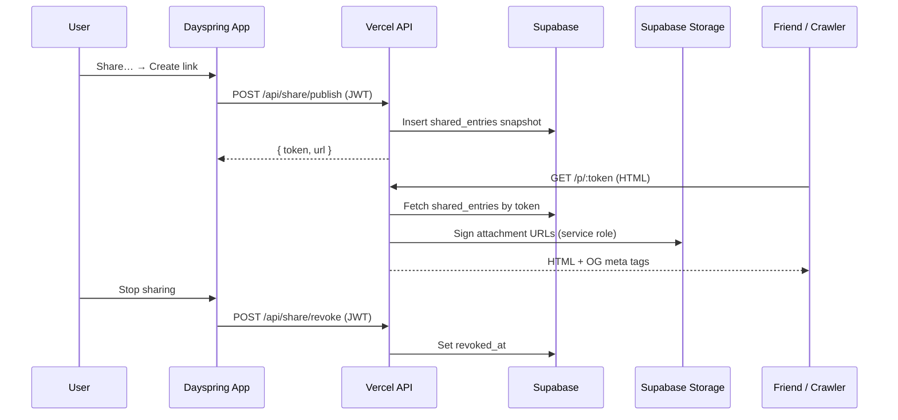

# Entry Sharing — implementation plan

**Status:** proposed (2026-06-06)  
**Goal:** Let a user **share one entry** as a beautiful, standalone reading page — unlisted link, snapshot at share time, zero access to anything else in the journal. Framed as *offering* / testimony, not publishing or social.

Aligns with the P3 Growth milestone in Notion: *“A shareable, on-mission loop ships (framed as testimony/gift, never a growth gimmick).”*

Relates to [MULTI_TENANCY_PLAN.md](./MULTI_TENANCY_PLAN.md) (per-owner RLS) and [IMAGE_IMPORT_PLAN.md](./IMAGE_IMPORT_PLAN.md) (attachment storage).

---

## 1. Product summary

### Jobs to be done

| Job | Example | Primary output |
|-----|---------|----------------|
| **Send while processing** | “Here’s what I’m sitting with — read this” | Link in iMessage / group text |
| **Offer a testimony** | Prayer answered, passage reflection | Same link, maybe saved as image later |
| **Sample the writing experience** | Friend discovers Dayspring via footer | Warm traffic, not a growth loop |

### Principles

1. **Private by default** — sharing is opt-in, per entry, explicit.
2. **Snapshot, not live mirror** — what you send doesn’t change when you keep editing privately. Offer “Update shared version” later.
3. **Unlisted link** — unguessable token; `noindex` by default; no public profile or entry index.
4. **One renderer** — reuse `markdownForDisplay` + `renderMarkdown`; extend for spiritual blocks and attachments.
5. **Subtle in-app** — context menu + top bar; never in the writing toolbar or focus mode.

### Non-goals (v1)

- Public profile, followers, comments, reactions
- Password-protected or expiring links (v2+)
- Block-level excerpt sharing (v2)
- IG Stories 9:16 template (v1.5 — after link + 4:5 card)
- Indexing / SEO for shared pages

---

## 2. User experience

### Entry points

| Surface | Control | Notes |
|---------|---------|-------|
| **Entry context menu** | `Share…` | Between Copy Markdown and Export; same portal pattern as today |
| **Journal top bar** | ↗ icon | When an entry is open; opens the same sheet |
| **Entry list row** | Subtle dot when live | Tap row → manage via context menu or top bar |

Not in: `CommandToolbar`, slash palette, focus mode, bulk menu.

### Share sheet (single modal)

Portaled bottom sheet (mobile) / compact glass modal (desktop) — same shell as `EntryEditDateModal`.

```
┌─────────────────────────────────────────┐
│  Share                                  │
│  Only this entry is visible. Everything │
│  else stays private.                    │
│                                         │
│  ┌───────────────────────────────────┐  │
│  │  [Live preview — public layout]   │  │
│  └───────────────────────────────────┘  │
│                                         │
│  Display name   [Phil          ▾]     │
│  ☑ Show date                            │
│  ☑ Include images                       │
│                                         │
│  ── when not shared ──                  │
│  [ Create link ]                        │
│                                         │
│  ── when shared ──                      │
│  dayspring.app/p/x7k…    [ Copy ]       │
│  [ Update shared version ]              │
│  [ Stop sharing ]                       │
└─────────────────────────────────────────┘
```

**First-time gate:** one sentence of consent before `Create link` is enabled (no separate onboarding flow).

**Copy link** uses Web Share API when available (`navigator.share`), else clipboard.

### Public page (what recipients see)

Standalone reading page — no app chrome, no auth, no navigation to other entries.

```
┌─────────────────────────────────────────┐
│                                         │
│     Entry title (H1, Fraunces)          │
│     Phil · June 6, 2026                 │
│                                         │
│     Body (Newsreader, ~42rem max)       │
│     — prose, lists, blockquotes         │
│     — prayer / sense / scripture blocks │
│       styled (not raw fences)           │
│     — images inline                     │
│                                         │
│     ─────────────────                   │
│     Written in Dayspring                │
│     (quiet link to landing / waitlist)  │
└─────────────────────────────────────────┘
```

**Theme:** warm light (`data-theme="share"` or dedicated CSS) — paper/sepia, distinct from the in-app dark editor. Mobile-first typography; same max-width discipline as the writing column.

---

## 3. Architecture

### High-level flow



### Why server-rendered HTML (not SPA-only)

Link unfurls (iMessage, Slack, X, Discord) require **OG tags in the first HTML response**. The Vite SPA bootstraps too late for most crawlers.

**Decision:** `/p/:token` rewrites to a Vercel API route that returns a complete HTML document. No React mount required for the public page in v1.

### Why a separate `shared_entries` table

| Approach | Pros | Cons |
|----------|------|------|
| Columns on `entries` | Fewer joins | Mixes private + public concerns; snapshot versioning awkward |
| **`shared_entries` table** | Clean snapshot; revoke without touching entry; public RLS isolated | One extra table |

One **live** share per entry (`unique (entry_id) where revoked_at is null`).

---

## 4. Data model

### Migration: `shared_entries`

```sql
-- supabase/migrations/20260606120000_shared_entries.sql

create table if not exists public.shared_entries (
  id              uuid primary key default gen_random_uuid(),
  entry_id        uuid not null references public.entries (id) on delete cascade,
  owner           uuid not null references auth.users (id) on delete cascade,
  token           text not null,                    -- URL slug; 128-bit entropy, base64url
  snapshot_body   text not null,                    -- frozen markdown at publish time
  snapshot_title  text,                             -- derived title, denormalized for OG
  options         jsonb not null default '{}'::jsonb,
  -- options schema: { "show_date": true, "include_images": true, "author_name": "Phil" }
  published_at    timestamptz not null default now(),
  revoked_at      timestamptz,                      -- null = link is live
  created_at      timestamptz not null default now(),
  updated_at      timestamptz not null default now()
);

create unique index shared_entries_token_key
  on public.shared_entries (token);

-- At most one live share per entry
create unique index shared_entries_one_live
  on public.shared_entries (entry_id)
  where revoked_at is null;

create index shared_entries_owner_idx
  on public.shared_entries (owner);

drop trigger if exists shared_entries_set_updated_at on public.shared_entries;
create trigger shared_entries_set_updated_at
  before update on public.shared_entries
  for each row execute function public.set_updated_at();

alter table public.shared_entries enable row level security;

-- Owner: full CRUD on their shares (for listing state in the app)
create policy "shared_entries: owner full access"
  on public.shared_entries
  for all
  to authenticated
  using (auth.uid() = owner)
  with check (auth.uid() = owner);

-- Public read: anon may SELECT live rows only (API uses service role anyway;
-- this is defense-in-depth if we ever query from client with anon key)
create policy "shared_entries: public read live"
  on public.shared_entries
  for select
  to anon
  using (revoked_at is null);
```

### Optional: `profiles.display_name`

For v1, `options.author_name` on the share row is enough (default from Google name / email local-part). Later:

```sql
alter table public.profiles
  add column if not exists display_name text;
```

### TypeScript types (`src/lib/types.ts`)

```ts
export interface ShareOptions {
  show_date: boolean
  include_images: boolean
  author_name: string | null
}

export interface SharedEntry {
  id: string
  entry_id: string
  token: string
  snapshot_body: string
  snapshot_title: string | null
  options: ShareOptions
  published_at: string
  revoked_at: string | null
}
```

### Token generation

```ts
// 128 bits → 22-char base64url; unguessable, URL-safe
const token = crypto.randomBytes(16).toString('base64url')
```

URL shape: `https://dayspring.app/p/{token}`

---

## 5. API routes

All under `api/share/`. Use existing `getAuthedUser` for mutating routes; `supabaseAdmin` for public reads.

### `POST /api/share/publish`

**Auth:** Bearer JWT  
**Body:** `{ entry_id, options?: Partial<ShareOptions> }`

1. Verify `entry_id` belongs to `auth.uid()` (via RLS or explicit check).
2. Derive title from `snapshot_body` using existing `deriveTitle` logic (port to `api/_lib/` or share a isomorphic module).
3. If a live share exists for this entry → **update** snapshot + options + `updated_at` (same token).
4. Else → insert new row with fresh token.
5. Return `{ token, url, published_at }`.

### `POST /api/share/revoke`

**Auth:** Bearer JWT  
**Body:** `{ entry_id }`

Set `revoked_at = now()` on the live row. Idempotent.

### `GET /api/share/status?entry_id=…`

**Auth:** Bearer JWT  
Returns live share metadata for the entry list indicator and share sheet prefill. `{ shared: false }` or `{ shared: true, token, url, options, published_at, updated_at }`.

### `GET /api/share/page?token=…` (public HTML)

**Auth:** none  
**Rewrite:** `/p/:token` → this handler

1. Load `shared_entries` where `token = $1 and revoked_at is null` (service role).
2. 404 → minimal “This page isn’t available” HTML (no leak of existence).
3. Build display markdown:
   - `markdownForDisplay(snapshot_body, { asTitle: true })`
   - Transform spiritual fences → HTML blocks (see §6)
   - If `!options.include_images`, strip `attachment:` refs
   - Resolve `attachment:` → proxy URLs `/p/:token/a/:hash.:ext` (see below)
4. `renderMarkdown()` → sanitized HTML
5. Emit HTML with:
   - `og:title`, `og:description` (first ~160 chars plain text), `og:type=article`
   - `og:image` if first image exists (proxy URL)
   - `twitter:card=summary_large_image`
   - `<meta name="robots" content="noindex, nofollow">`
   - Inline or linked `share.css` (subset of `.markdown-body` + spiritual block styles)
   - Footer CTA

### `GET /api/share/asset?token=…&hash=…&ext=…` (image proxy)

**Auth:** none

1. Validate token → live share → owner id.
2. Verify `hash` appears in `snapshot_body` (prevent arbitrary storage reads).
3. Stream from `attachments` bucket via service role signed URL or direct download.

Long-lived public pages without copying blobs to a public bucket.

---

## 6. Markdown & rendering

### Reuse today

| Module | Role |
|--------|------|
| `src/lib/entryMarkdown.ts` | First-line title promotion, task normalization |
| `src/lib/markdown.ts` | marked + DOMPurify |
| `src/styles/global.css` | `.markdown-body` rules → extract to `share.css` |

`printEntry` in `entryActions.ts` is the closest existing pattern — public page is “print quality, but beautiful and on-brand.”

### New: `src/lib/shareMarkdown.ts`

**Spiritual blocks:** fence blocks must render as styled callouts, not raw ` ```dayspring-pray `.

```ts
// Pseudocode
export function markdownForShare(body: string, opts: ShareMarkdownOptions): string {
  let md = markdownForDisplay(body, { asTitle: true })
  md = spiritualFencesToHtmlBlocks(md)  // or pre-marked custom extension
  if (!opts.includeImages) md = stripAttachmentRefs(md)
  return md
}
```

Fence → HTML mapping (v1, static):

| Fence | Public presentation |
|-------|---------------------|
| `dayspring-pray` | Blockquote-style with subtle label “Prayer” |
| `dayspring-sense` | Same, label “Sense” |
| `dayspring-scripture` | Scripture block: verse body + reference line, serif |

Do **not** expose spiritual item UUIDs, thread ids, or Altar metadata.

### Attachments

Reuse `ATTACHMENT_REF_RE` from `src/lib/attachments.ts`. Public URLs point at the proxy route, not expiring Supabase signed URLs embedded in HTML.

When `include_images: false`, strip refs before render (same as omitting broken images).

---

## 7. Client integration

### New files

| File | Purpose |
|------|---------|
| `src/lib/share.ts` | `publishShare`, `revokeShare`, `getShareStatus`, `shareUrl(token)` |
| `src/features/journal/EntryShareSheet.tsx` | Portal modal + preview + actions |
| `src/features/journal/SharePreview.tsx` | In-app preview using same CSS as public page (iframe or shared class) |

### Modified files

| File | Change |
|------|--------|
| `EntryContextMenu.tsx` | Add `share` action + menu item |
| `entryMenuIcons.tsx` | `share` icon |
| `JournalScreen.tsx` | Handle `share` menu action; hold share sheet state |
| `journalViewProps.ts` | `onShareEntry`, optional `sharedEntryIds: Set<string>` |
| `DesktopJournal.tsx` / `MobileJournal.tsx` | Top-bar share button when entry open |
| `EntryList.tsx` | Row indicator when entry has live share |
| `lib/types.ts` | `SharedEntry`, `ShareOptions` |
| `vercel.json` | Rewrite `/p/:token` and `/p/:token/a/:hash.:ext` |

### Share status hydration

On journal load, batch-fetch live shares for visible entries (or all entries — cheap query):

```ts
supabase.from('shared_entries')
  .select('entry_id, token, published_at, updated_at')
  .is('revoked_at', null)
```

Store in `JournalScreen` state → pass to `EntryList` for indicators.

Alternatively: add `share_token` to entry list query via a view — defer unless perf matters.

---

## 8. Styling

### `public/share.css` (or `api/share/share.css`)

Extract from `global.css` `.markdown-body` + add:

- CSS variables for share theme (warm paper background, Newsreader body, Fraunces headings)
- `.share-spiritual--pray`, `--sense`, `--scripture`
- Footer, date byline, max-width container
- Safe area padding for mobile

Loaded only by the public HTML route — zero impact on app bundle.

### In-app preview

`SharePreview` imports the same CSS (or a shared chunk) so WYSIWYG matches the link.

---

## 9. Security & privacy

| Risk | Mitigation |
|------|------------|
| Token guessing | 128-bit random token |
| Enumeration | 404 for missing/revoked; uniform response time |
| Cross-user attachment read | Proxy verifies hash ∈ snapshot_body |
| Leaking private entry fields | Only `snapshot_*` + `options` exposed; never join live `entries` for public |
| Accidental index | `noindex, nofollow` on all public pages |
| Stale share after delete | `on delete cascade` from `entries` |
| Service role exposure | Admin client only in `api/` — never import from `src/` |

**Soft warning (v1.1):** if body contains `/pray` fence, show “This entry includes a prayer — still want to share?” (non-blocking).

---

## 10. Phasing

### P0 — Link (target: ~1.5–2 weeks)

- [ ] Migration `shared_entries`
- [ ] `POST publish`, `POST revoke`, `GET status`
- [ ] `GET page` HTML + `GET asset` proxy
- [ ] `share.css` + spiritual block transform
- [ ] `EntryShareSheet` + context menu + top bar
- [ ] Entry list live indicator
- [ ] `vercel.json` rewrites
- [ ] Manual QA: iMessage unfurl, mobile read, revoke → 404

**Exit criteria:** User shares entry → friend opens link on phone without account → readable, beautiful, nothing else accessible.

### P1 — Card export (~3–5 days)

- [ ] “Save image” in share sheet
- [ ] Client-side render via `html-to-image` or canvas from preview
- [ ] 1200×630 (OG) + 1080×1350 (IG feed) from one template

### P2 — Excerpt & polish (~1 week)

- [ ] Select paragraph/block → share excerpt only (separate snapshot or excerpt field)
- [ ] `profiles.display_name` default
- [ ] Prayer-name soft warning
- [ ] “Update shared version” copy when private entry edited after publish

### P3 — Trust features

- [ ] Expiring links
- [ ] Password protection
- [ ] Optional `index` opt-in for specific shares
- [ ] 9:16 Stories template if validated by usage

---

## 11. Testing plan

### Unit

- `shareMarkdown.ts`: fence → HTML, image strip, title promotion
- Token uniqueness (mock DB)

### Integration

- Publish → public HTML contains title, body, OG tags
- Revoke → 404
- Image proxy rejects hash not in snapshot
- RLS: user A cannot revoke user B’s share

### Manual

| Case | Expected |
|------|----------|
| Share → copy link → open in Safari iOS | Readable, no horizontal scroll |
| Paste link in iMessage | Rich preview with title (+ image if present) |
| Stop sharing → old link | “Not available” page |
| Entry with `/pray` block | Renders as styled prayer, not raw fence |
| Entry with image, include_images off | No images in public page |
| Delete entry | Link dead |

---

## 12. Open questions

1. **Update vs new link on re-share** — Plan: same token, refresh snapshot (link stays valid). Confirm this matches “I edited typos before sending the link again” vs “I want a new link.”
2. **Display name source** — Google full name vs editable profile field for v1?
3. **Footer CTA** — Link to marketing site, waitlist, or app store when native ships?
4. **Analytics** — Count public page views (privacy-preserving, no cookies) for understanding share loop? Defer?
5. **Entitlement** — Free for all users, or premium? Recommendation: **free** — sharing is testimony/WOM, gating feels wrong for this audience.

---

## 13. File checklist (P0)

```
supabase/migrations/20260606120000_shared_entries.sql
api/_lib/share.ts
api/share/publish.ts
api/share/revoke.ts
api/share/status.ts
api/share/page.ts
api/share/asset.ts
api/share/share.css
src/lib/share.ts
src/lib/shareMarkdown.ts
src/lib/shareMarkdown.test.ts
src/features/journal/EntryShareSheet.tsx
src/features/journal/SharePreview.tsx
vercel.json                          (rewrites)
src/features/journal/EntryContextMenu.tsx
src/features/journal/entryMenuIcons.tsx
src/features/journal/JournalScreen.tsx
src/features/journal/journalViewProps.ts
src/features/journal/DesktopJournal.tsx
src/features/journal/MobileJournal.tsx
src/features/journal/EntryList.tsx
src/lib/types.ts
```

---

## 14. Success metrics (post-launch)

Qualitative first (alpha): do users share without prompting? Do recipients comment on readability?

Quantitative (when instrumented):

- % of WAU who share ≥1 entry / month
- Share → app landing click-through (footer)
- Revoke rate (high = privacy anxiety; investigate UX)

Not a success metric: total public pages indexed in Google (should be ~0).
