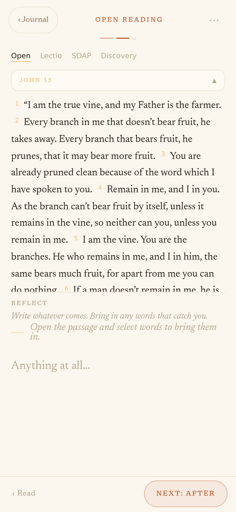
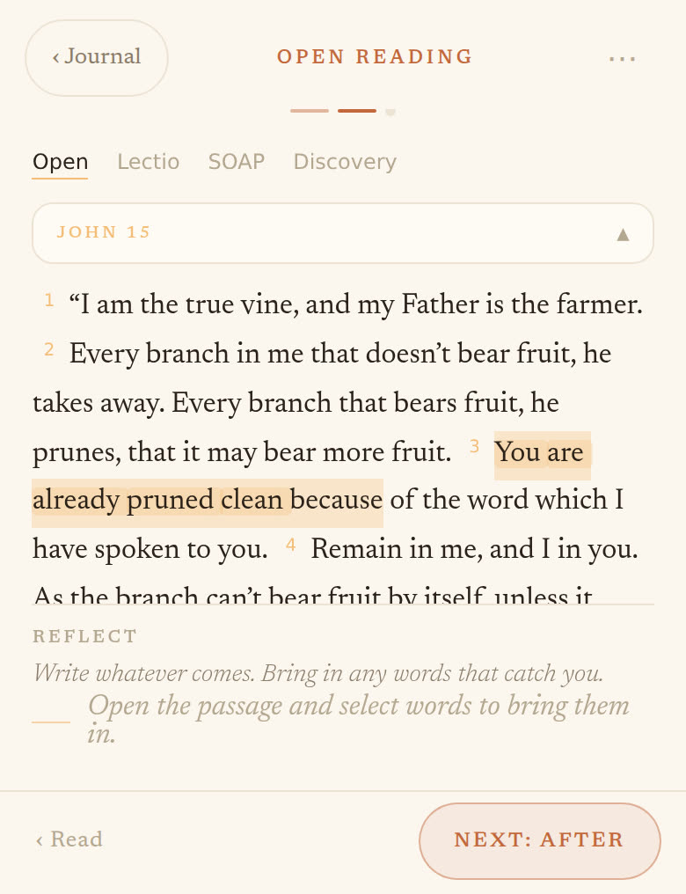
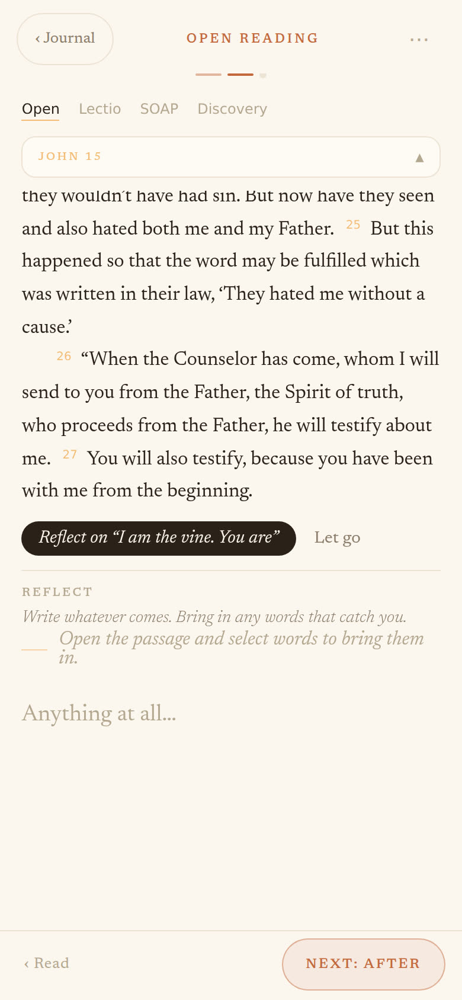
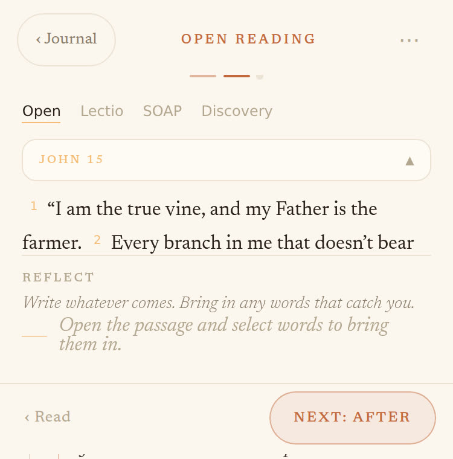

# Scripture reflection on a phone — audit

**Date:** 2026-10-02 · **Surface:** Open your Bible → the ritual composer's phone
layout (`RitualComposer.tsx`, the filmstrip) · **Prompted by:** Phil tried to select
a line, it "disappeared below", and he couldn't see what he was writing.

**Short version.** Both things Phil felt are real, reproducible, and the same bug seen
from two sides: on a phone the passage and the page share one screen with no rule about
who gets the room. With the keyboard up the writing area is **0px tall**. And the button
that brings selected words in lives at the **end of the chapter**, inside the passage's
scroll box — for words chosen in verse 5 of John 15 it is ~1,800px below the fold.

Nothing here is a design flaw in the idea (Principle 3, the editor is sacred, is exactly
what is being violated). It is a layout that was built for the desk and then folded for
the phone.

---

## How this was checked, and what that doesn't prove

I ran the real app (`?__preview=ritual&blank=1`, the same harness the What's new capture
script uses) in Chromium at 390×844 and 375×667 with touch, an iPhone user agent, and
the harness's public-domain chapter. Driving it: Open your Bible → John → 15 → the
composer opens on the first writing movement, passage open (exactly what `choosePassage`
does, `RitualComposer.tsx:772-782`).

- **The keyboard is emulated.** iOS keeps the layout viewport at full height and shrinks
  the visual viewport; the composer sizes itself to the visual viewport
  (`useVisualViewportFrame`, `RitualComposer.tsx:303`). I did the same: left
  `innerHeight` at 844 and set the composer to `844 − 336`px (a typical iPhone keyboard
  plus suggestion bar; 291px for the SE). That is why `vh` units misbehave in the real
  thing and in this test.
- **Selection is driven through the Selection API** with a synthetic `pointerdown`,
  because headless Chromium can't long-press. Anything that depends on *real* iOS
  selection handles, the system callout, or WebKit's pointer-event behaviour is marked
  **device check** below. Everything else was measured, not inferred.
- No source was changed. Screenshots are in `docs/audit-assets/scripture-mobile/`.

---

## What you hit

*Arrival, no keyboard.* Eight things stacked before the writing line: masthead, progress
pips, the practice switcher (Open · Lectio · SOAP · Discovery), the passage strip, a
321px passage box, the label, the question, a second line of instruction, and only then
the textarea — with the footer under it. ~646 of 844px is not writing.

*Keyboard up, after selecting "You are already pruned clean because" in verse 3.* The
words are lit in the passage. There is no button anywhere on screen to do anything with
them, and there is no writing area: **textarea height 0px**, passage box 183px (6 lines
of a 27-verse chapter). The footer's **Next: After** is the only action in view — which is
the wrong one.

*Where "Reflect on …" actually is:* after verse 27, at the bottom of the passage's own
scroll box (`scrollHeight` 1,868px in a 182px window). You only find it by scrolling the
whole chapter to the end.

---

## Findings

Ranked by whether they stop the task. **Measured** = reproduced here. **Device check** =
needs a real iPhone before anyone trusts a fix.

### P0 — you cannot do the thing

**1. The writing area collapses to nothing when the keyboard is up.** *Measured.*
390×844 + keyboard: textarea **0px**. 375×667 + keyboard: textarea **0px**, passage box 51px.

Cause is arithmetic, not a bug in one rule. `.rc__write` is `flex: 1; min-height: 0`
(`RitualComposer.css:181-184`) in a fixed-height column, so it takes whatever is left —
and everything above it is fixed or sized off the wrong viewport:

- the passage box is `max-height: 38vh` (`Passage.css:600-606`). `vh` is the *layout*
  viewport (844), so it asks for 320px of a screen that is now ~508px tall;
- the strip is opened on arrival (`setOpenStrip(firstWrite)`, `RitualComposer.tsx:780`);
- the composer already has a "yield" rule — the question shrinks and the pips fold away
  (`yielding`, `RitualComposer.tsx:744`; `.rc__q[data-small]`, `RitualComposer.css:172`)
  — but it only fires *after* there are words, and nothing about the passage yields.

**2. The confirm button is out of sight.** *Measured.* The "Reflect on “…”" / "Let go" pair
is rendered *inside* `.rc__psg-top`, after the passage (`RitualComposer.tsx:1304-1317`),
and that box scrolls (`overflow-y: auto`). In the test it sat 1,811px down a 182px box.

On a phone there is nothing else to fall back on: the desk's chip (`QuoteChip`) and ghost
(`QuoteGhost`) are desk-only (`RitualComposer.tsx:1034, 1193`), and "↵ to bring it in"
needs a hardware keyboard. The one other route is the verse-number tap (finding 4).

**3. After you bring words in, you can't see them land.** *Measured.* `bringIn` inserts
`> words (v. 5)` into the textarea and refocuses it (`RitualComposer.tsx:855-881`); with
the keyboard up that textarea is 0px, so the quote and the caret are invisible. The
passage box stays open, still taking the room. Nothing confirms the quote landed.

### P1 — it works, but it will burn you

**4. One tap on a 17×21px verse number inserts the whole verse.** *Measured.* Verse numbers
in a quoting movement are buttons (`PassageText.tsx:217-226`, `.psg__n--cite`,
`Passage.css:140-153`). One tap on "5" put all of verse 5 into the answer. They sit at the
start of each line, which is where a thumb lands when it starts a selection.

**5. Lectio's "catch a word" can't catch a phrase on touch, and the copy promises it does.**
*Measured for the tap; device check for the selection.* The prompt says "Touch a word
above, or **tap two** for a phrase" (`RitualComposer.tsx:1023`). There is no tap-two
gesture anywhere in `src/`. A tap takes one word immediately with no confirmation (I
caught "it"). A long-press phrase selection ends in `pointercancel`, and `mark` mode only
reads the selection on `pointerup` (`PassageText.tsx:289-306`) — with a synthetic
`pointercancel`, nothing was caught. (Quoting movements are fine here because they read
the selection live via `selectionchange`.)

**6. A scroll-swipe on the passage leaves the "pointer is down" flag stuck.** *Measured.*
`down.current` is set on `pointerdown` and cleared only on `pointerup`
(`PassageText.tsx:148, 286-295`). A finger scrolling the passage emits `pointerdown` then
`pointercancel` — I recorded exactly `["pointerdown","pointercancel"]` — so after the
first scroll, every later `selectionchange` is treated as the writer choosing words. A
selection made with no pointer down at all registered as a pending quote. *Device check*
for how WebKit orders these on a real long-press, but the flag cannot be trusted either way.

**7. The caught word lights a different word.** *Measured.* `findPhrase` does a substring
`indexOf` on the first verse that contains it (`passage.ts:161-173`). Caught "it" and the
passage lit the "it" inside **fru*it*,** in verse 2. A phone makes single-word catches the
norm, and small words are common. Violates "grounded, or silent": the highlight claims a
place the writer didn't pick. Not mobile-only; mobile makes it show up.

**8. Too many things, and two lines saying the same thing.** The question says "Write
whatever comes. Bring in any words that catch you." and directly under it the hint says
"Open the passage and select words to bring them in" (`RitualComposer.tsx:1028-1033`) —
shown while the passage is *already open*, and it wraps to an orphaned "in." beside a
lone gold rule (`Passage.css:526-535`). The practice switcher row stays on screen until something is
written (`ways`, `RitualComposer.tsx:816-836`), even though the choice of practice is not
what someone mid-passage is doing.

**9. Arrival is keyboard-first.** *Likely; device check.* Choosing a chapter immediately
focuses the textarea (`RitualComposer.tsx:665-671`), so the first view of John 15 can be
a 51–183px slot onto a 27-verse chapter with the keyboard already up. "Straight to
writing" was a deliberate call (Sept 26, comment at `RitualComposer.tsx:772`); this is its
cost on a small screen. iOS may refuse a programmatic focus outside a gesture, which would
hide it.

### P2 — polish, and promises

**10. Tap targets under the stated floor.** `MOBILE_DESIGN.md` sets 48px. Measured: the
practice switcher buttons **32×20**, the passage strip **35px** high, "Let go"
(`Passage.css:719`) and "choose another" (`Passage.css:546`) are unpadded text buttons, about
one line high.

**11. The What's new promises things the phone doesn't do.** Card 2, step 3
(`releases.ts:207`): words "land on your page as a quote, **with a line drawn back to where
you took them**". The line is hidden under 900px (`Passage.css:689`) and the dashed ghost
is desk-only. On a phone the quote lands as raw `> … (v. 5)` markdown in a plain textarea.
The highlight in the passage *does* work, which is the honest half. The deck is shown to
phone users too.

**12. A whole chapter is the default passage.** Tapping a chapter number goes straight into
the composer with all of it (27 verses → a scroll box, finding 2). Choosing fewer verses
means typing a range. The finder's verse-picking copy is desk language: "Click a verse to
start again · **shift-click** to extend" (`PassageFinder.tsx:380`).

**13. Device checks I could not make:** the iOS selection callout (Copy / Look Up / Share)
sitting over the selected words and any bar near them; whether a horizontal drag on
selection handles in the passage is taken by Embla and swipes to the next movement; whether
the folded-strip → open transition shifts the line under a finger mid-selection.

### What already works

The finder on a phone is good — a thumb-sized chapter grid, 44px back and next, safe areas
respected. The composer follows the visual viewport, not
the layout one, and the spine and question yielding is the right instinct. The Read
movement gives the passage the whole pane, which is how a passage should be read. Verses
quoted into an answer do light in the passage.

---

## What I'd do, in order

The principle to apply is the one the composer already half-uses: **the passage and the
page take turns; they don't share.** Reading/choosing and writing are different postures,
and on a 6-inch screen they can't both be open with a keyboard.

1. **Pin the confirm bar (finding 2).** Move "Reflect on …" out of the scroll box, to a
   fixed edge of the passage area (or just under it) so it is on screen whenever a
   selection exists. Smallest change, removes the worst of what Phil hit. Small.
2. **Turn-taking (findings 1, 3, 9).** Open passage ⇒ the textarea is not focused, so no
   keyboard. Focus the textarea ⇒ the passage folds to its strip. Bringing words in folds
   the passage and puts the caret under the quote, so you see it land and keep writing.
   Size what remains from the visual viewport (`frame.height`), never `vh`, and give the
   textarea a floor it can't go below. Small–medium; this is the real fix.
3. **Quieter stack (finding 8).** One line of instruction, not two, and only while there's
   nothing to read it against. Drop the practice switcher from the phone once a passage is
   open (it stays reachable under ⋯). Small.
4. **Touch-correct selection (findings 5, 6).** End a gesture on `pointercancel` as well as
   `pointerup`, or stop keying off pointer state and debounce `selectionchange`. Make the
   Lectio mark movement read the live selection like the quoting movements do, and say what
   it does ("Touch a word, or select a phrase"). Small; needs a device.
5. **Verse numbers (finding 4).** Don't make a 17px control insert a whole verse. Keep it
   desk-only, or move whole-verse quoting behind a long-press with a visible confirmation.
   Small.
6. **Whole-word catch (finding 7).** Match on word boundaries, or keep the verse and offset
   with the caught word. Small, with a test (`it` ≠ `fruit`).
7. **Say it honestly (finding 11).** Either draw something for the phone (the quote's verse
   number lighting in the passage already half does it) or make the What's new steps not
   promise the line on a phone. Copy only.

Not in this list: a bottom-sheet passage, a split view, an iPad layout. Each is a larger
bet than the bug is; items 1–2 should be tried first and judged on a phone in hand.

## To verify any fix

On a physical iPhone (and the iOS Simulator for the cheap passes), a 27-verse chapter:
open it → the keyboard does not cover the passage; select a phrase mid-chapter → a
confirm is visible without scrolling; bring it in → the quote is visible above the keyboard
with the caret after it; select again → still works after a scroll-swipe; Lectio → a
phrase can be caught; a SE-sized screen with the keyboard up still shows ≥ 3 lines of
writing. The repro used for this audit is ~100 lines of Playwright against the preview
harness and can become a script beside `scripts/capture-whats-new.mjs`.
